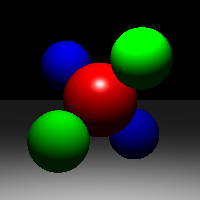
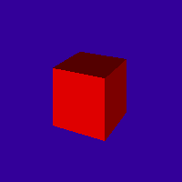
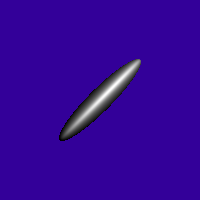
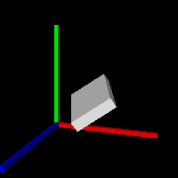
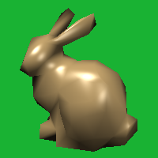
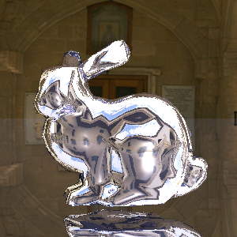
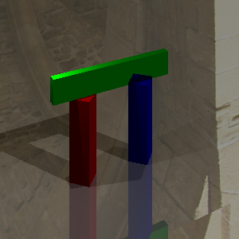

# Project 2 光照模型与光线追踪
21307130105 杨子旭 21307130424 范凯旋

# Phong着色模型

### PointLight::getIllumination()函数
(a)tolight：从场景中一个点指向到光源的方向矢量（归一化后的）。

(b)intensity：此时的照明强度（RGB）。

(c)distToLight：场景点与光源之间的距离。

距离场景点x_surf的距离为d的点光的强度为:

$L(x_{surf})=\frac{I}{\alpha d_2}$

### 漫反射（Diffuse）：Material.cpp中的Material::shade()

给定光线方向 L 和屏幕法向量 N，当 L·N<0 时，光源在切平面以下，此时不计算漫反射。计算漫反射阴影的公式如下：

$clamp(L,N) = \begin{cases} L·N,\quad if\ L·N>0\\ 0, \quad \quad otherwise \end{cases}$

相关代码：
```cpp
float dotNL = Vector3f::dot(dirToLight, normal); // Cosine of angle between light and normal
float diffuseFactor = std::max(dotNL, 0.0f);
```

结合漫反射材料反射率$k_{diffuse}$和光强 L，漫反射的强度可以计算为：

$I_{diffuse}=clamp(L·N)*L*k_{diffuse}$

每个 RGB 通道要单独计算。相关代码：

```cpp
Vector3f diffuse = diffuseFactor * lightIntensity * _diffuseColor;
```

### 镜面反射（Specular）

镜面反射的强度取决于光泽度 s、表面对眼睛的方向 E、完美反射矢量 R、对光的方向 L、表面法线 N。镜面反射项的公式为：

$I_{specular} = clamp(L,R)^s*L*k_{specular}$

这个公式与漫反射相似，不同点在于使用完美反射矢量 R 和 L的夹角计算。相关代码：

```cpp
Vector3f reflectDir = 2 * Vector3f::dot(normal, viewDir) * normal - viewDir; // Reflection direction
float dotLR = Vector3f::dot(dirToLight, reflectDir);
float specularFactor = std::max(dotLR, 0.0f);
Vector3f specular = pow(specularFactor, _shininess) * lightIntensity * _specularColor;
```

### Phong光照模型

Phong光照模型把这些项加起来。

物体表面某点环境光的定义为：

$I_{ambient} = L_{ambient}*k_{diffuse}$

Phong 光照模型是环境光、漫反射和镜面反射吗的结合，简单相加得到：

$I = I_{ambient} + \sum_{i \in lights} I_{diffuser,i} +I_{specular,i}$

对于每个达到的点，需要遍历场景中的光源来计算光照 shade，并与环境光相加。相关代码：

```cpp
Vector3f color(0, 0, 0);                         // Final color
Vector3f hitPoint = ray.pointAtParameter(hit.getT());
Vector3f normal = hit.getNormal();
Material *material = hit.getMaterial();

// Step 2: Direct illumination from all lights
for (int i = 0; i < _scene.getNumLights(); ++i) {
Vector3f dirToLight, lightIntensity;
float distToLight;
_scene.getLight(i)->getIllumination(hitPoint, dirToLight, lightIntensity, distToLight);

// Step 2.1: Shadow ray check // used in section 3
bool inShadow = false;
if (_args.shadows) {
Ray shadowRay(hitPoint + dirToLight * 1e-3f, dirToLight); // Avoid self-intersection
Hit shadowHit;
if (_scene.getGroup()->intersect(shadowRay, 1e-3f, shadowHit) && shadowHit.t < distToLight) {
inShadow = true;
}
}

// Step 2.2: Add contribution if not in shadow // used in section 3
if (!inShadow) {
color += material->shade(ray, hit, dirToLight, lightIntensity);
}
}

// Step 3: Add ambient light
color += _scene.getAmbientLight() * material->getDiffuseColor();

return color;
```

# 光线投射

### 平面类（Plane）

平面方程定义为$P·n=d$，d 为相对圆脸的偏移量，n 为平面法线，P 是平面上的点。

```cpp
class Plane : public Object3D
{
public:
    Plane(const Vector3f &normal, float d, Material *m);

    virtual bool intersect(const Ray &r, float tmin, Hit &h) const override;

private:
    // TOOD fill in members
    Vector3f _normal; 
    float _d; 
};
```

下面来编写 intersect 函数。当光线与平面相交时，设交点为 p，光源起点为 o，光源方向向量为 d。
```cpp
    const Vector3f &rayOrigin = ray.getOrigin();
    const Vector3f &rayDir = ray.getDirection();
```

设平面内另一个点为 p'，因为 p'在平面内，所以满足$p'·n=d'$，故结合 p 和 p'，有(p-p')·N=0。此时有 p-p'这个向量与法线方向正交。故计算相交距离的公式为：

$t = \frac{(p'-0)\cdot N}{d \cdot N} = \frac{d'-o\cdot N}{d\cdot N}$
```cpp
    float denom = Vector3f::dot(rayDir, _normal);
    // If denom is near zero, the ray is parallel to the plane
    if (fabs(denom) < 1e-6f) {
        return false;
    }

    float t = (_d - Vector3f::dot(rayOrigin, _normal)) / denom;
```

相交函数还要更新 hit 存储的法向量值、颜色和相交距离。
```cpp
    // Ignore intersections behind the ray start or too close
    if (t < tmin || t >= hit.getT()) {
        return false;
    }

    // Valid intersection, update the hit record
    hit.set(t, this->material, _normal);
    return true;
```

### 三角形类（Triangle）

构造函数输入3个顶点，每个顶点包括法线和材质的信息。
```cpp
class Triangle : public Object3D
{
public:
    Triangle(const Vector3f &a,
        const Vector3f &b,
        const Vector3f &c,
        const Vector3f &na,
        const Vector3f &nb,
        const Vector3f &nc,
        Material *m) :
        Object3D(m)
    {
        _v[0] = a;
        _v[1] = b;
        _v[2] = c;
        _normals[0] = na;
        _normals[1] = nb;
        _normals[2] = nc;
    }

    virtual bool intersect(const Ray &ray, float tmin, Hit &hit) const override;

    const Vector3f & getVertex(int index) const {
        assert(index < 3);
        return _v[index];
    }

    const Vector3f & getNormal(int index) const {
        assert(index < 3);
        return _normals[index];
    }

private:
    Vector3f _v[3];
    Vector3f _normals[3];
};
```

根据射线与三角形相交的 Möller-Trumbore 算法，设三角形 ABC、射线 r（原点为 o，方向向量为 d），假设射线与三角形所在平面交于 P 点，则 P 一定可以表示为三角形三个顶点的线性组合，且系数之和为 1：

$P = \omega A+uB+vC = (1-u-v)A+uB+vC = A+u(B-A)+v(C-A)$

又由 P在射线 r 上，可得公式：

$P = o+t\cdot d$

故得到以下公式：

$A+u(B-A)+v(C-A) = o+t\cdot d$

$o-A = -t\cdot d +u(B-A)+v(C-A)$

求解 t、u 和v 时可以转为矩阵计算：

$$\begin{bmatrix} 
-d&B-A&C-A
\end{bmatrix} \begin{bmatrix}
t\\
u\\
v\\
\end{bmatrix} = o-A$$

根据克莱姆法则，当$\begin{bmatrix} 
-d&B-A&C-A
\end{bmatrix} $可逆时方程可解，`Matrix3f::inverse()`可以求解该方程。对于三角形内的 P，需要满足三个系数都在 0 到 1 之间。

```cpp
 // Step 1: Define triangle edges
    Vector3f edge1 = _v[1] - _v[0];
    Vector3f edge2 = _v[2] - _v[0];

    // Step 2: Build matrix for solving [u, v, t]
    Matrix3f M(edge1, edge2, -ray.getDirection());

    // Step 3: Solve the linear system M * [u, v, t]^T = ray.origin - v0
    Vector3f rhs = ray.getOrigin() - _v[0];

    // Check if the matrix is invertible (triangle not degenerate or ray parallel)
    if (fabs(M.determinant()) < 1e-6f) {
        return false;
    }

    Vector3f solution = M.inverse() * rhs;
    float u = solution.x();
    float v = solution.y();
    float t = solution.z();

    // Step 4: Validate barycentric coordinates and ray parameter t
    bool isInsideTriangle = (u >= 0.0f) && (v >= 0.0f) && (u + v <= 1.0f);
    bool isValidT = (t >= tmin) && (t < hit.getT());

    if (!isInsideTriangle || !isValidT) {
        return false;
    }

    // Step 5: Compute interpolated normal (barycentric)
    Vector3f interpolatedNormal = (1.0f - u - v) * _normals[0] + u * _normals[1] + v * _normals[2];
    interpolatedNormal.normalize();

    // Step 6: Update hit record
    hit.set(t, this->material, interpolatedNormal);
    return true;
```

### 变换类（Transform）

变换类存储一个指向子对象三维节点的指针和一个4x4的变换矩阵M。这个矩阵将子对象从局部对象坐标移动到世界坐标。

```cpp
class Transform : public Object3D
{
public:
    Transform(const Matrix4f &m, Object3D *obj);

    virtual bool intersect(const Ray &r, float tmin, Hit &h) const override;

private:
    Object3D *_object; //un-transformed object   
    Matrix4f _m;
};
```

```cpp
Transform::Transform(const Matrix4f &m, Object3D *obj)
    : _m(m), _object(obj)
{
    // Store transformation matrix and target object
}
```
但是对于复杂的子对象，例如具有许多顶点的网格，每当我们想要跟踪一条射线时，我们不能将整个对象移动到世界坐标。而将光线从世界坐标移动到局部对象坐标要计算小得多。因此，我们通过和 PJ1 相似的变换矩阵来进行变换。

```cpp
    Vector3f transformedOrigin = (worldToLocal * Vector4f(ray.getOrigin(), 1)).xyz();
    Vector3f transformedDirection = (worldToLocal * Vector4f(ray.getDirection(), 0)).xyz();

    Ray rayLocal(transformedOrigin, transformedDirection);
```

命中点（Hit）找到的时候，命中法线也会在对象坐标中。再将法线从局部坐标转换回世界坐标。

```cpp
    // Step 2: Intersect in object’s local space
    Hit localHit;
    float scaledTmin = tmin * transformedDirection.abs(); // conservative scaling

    if (_object->intersect(rayLocal, scaledTmin, localHit)) {
        // Step 3: Transform the local-space normal back to world space
        Matrix4f normalTransform = worldToLocal.transposed(); // transpose(inverse(M))
        Vector3f worldNormal = (normalTransform * Vector4f(localHit.getNormal(), 0)).xyz().normalized();

        // Step 4: Commit the hit with world-space normal
        hit.set(localHit.getT(), localHit.getMaterial(), worldNormal);
        return true;
    }

    return false;
```

# 光线追踪与阴影投射

### 光线追踪

镜面材料会反射光线，带来间接照明，因此需要对镜面材料递归调用 `traceRay` 来进行光线追踪，最大递归深度游命令行参数`-bounces`决定。最终看到的光强是直接光强和间接光强的和：

$$I_{total} = I_{direct} + k_{specular}*I_{indirect}$$

计算反射光线的方向：
```cpp
// Step 4: Recursive reflection
if (bounces > 0) {
Vector3f viewDir = -ray.getDirection();
Vector3f reflectDir = ray.getDirection() - 2 * Vector3f::dot(ray.getDirection(), normal) * normal;
```

计算间接光强：
```cpp
Ray reflectRay(hitPoint + reflectDir * 1e-3f, reflectDir); // Avoid self-hit
Hit reflectHit;
Vector3f reflectedColor = traceRay(reflectRay, 1e-3f, bounces - 1, reflectHit);
```
将光强相加：
```cpp
color += reflectedColor * material->getSpecularColor();
```

### 阴影投射

阴影的计算方式是从物体表面交点（Hit）向光源（light）发送光线。如果在光源之前有相交点（Hit），则当前的表面点处于阴影中，并忽略来自该光源的直接照明。若位于阴影中，则直接将光强置为 0。

```cpp
// Step 2.1: Shadow ray check
bool inShadow = false;
if (_args.shadows) {
Ray shadowRay(hitPoint + dirToLight * 1e-3f, dirToLight); // Avoid self-intersection
Hit shadowHit;
if (_scene.getGroup()->intersect(shadowRay, 1e-3f, shadowHit) && shadowHit.t < distToLight) {
inShadow = true;
}
}

// Step 2.2: Add contribution if not in shadow
if (!inShadow) {
color += material->shade(ray, hit, dirToLight, lightIntensity);
}
```

# 生成结果
## scene01

## scene02

## scene03

## scene04

## scene05

## scene06

## scene07
