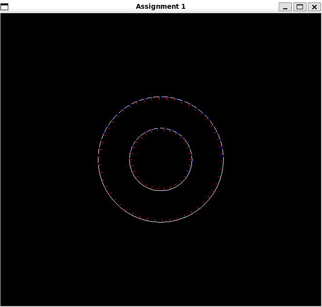
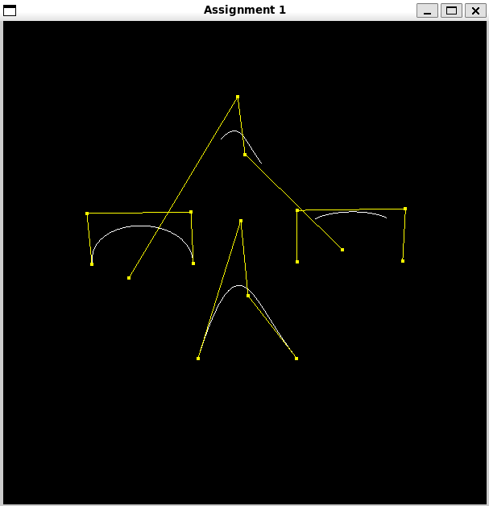
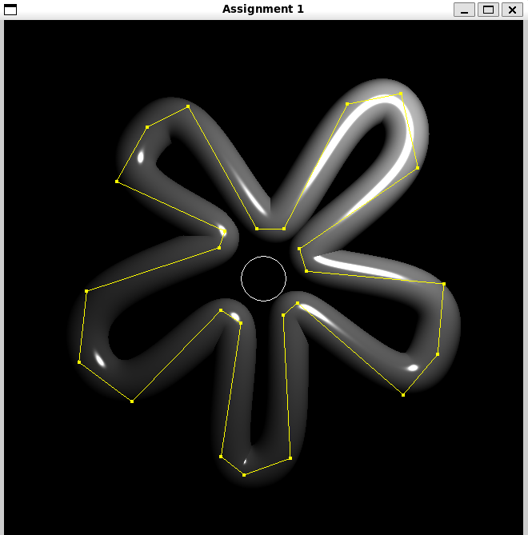
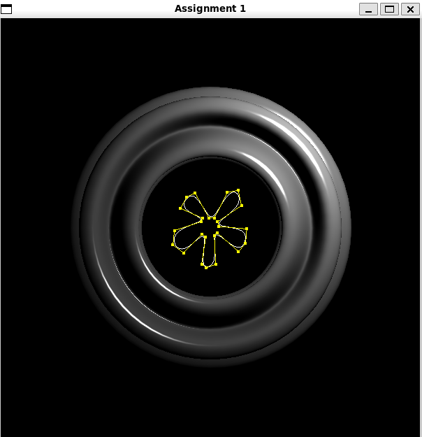
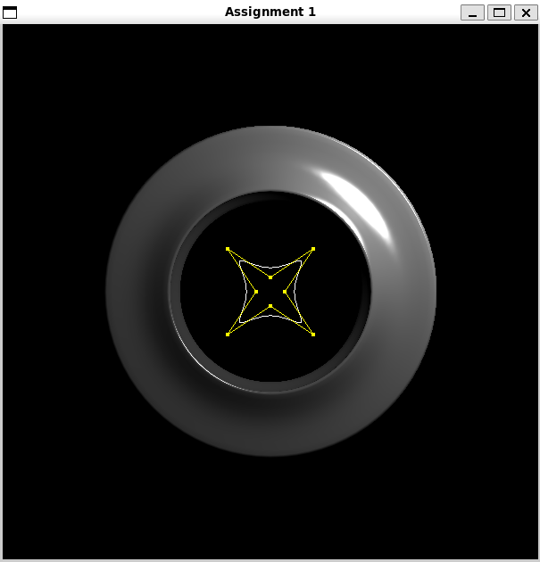
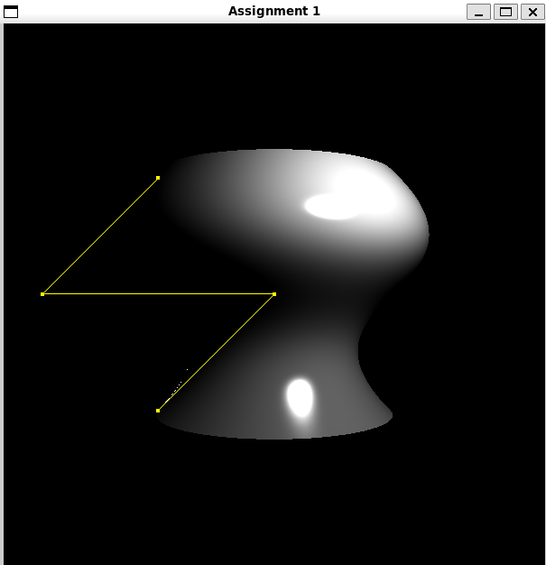
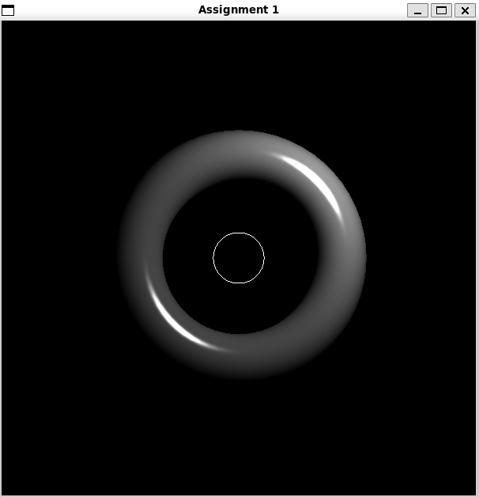
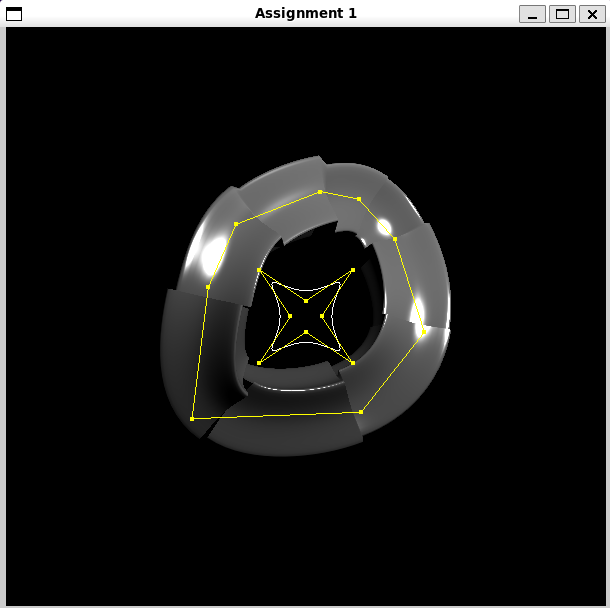
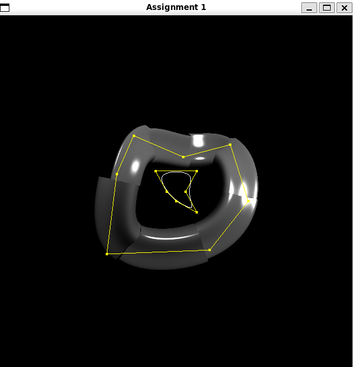
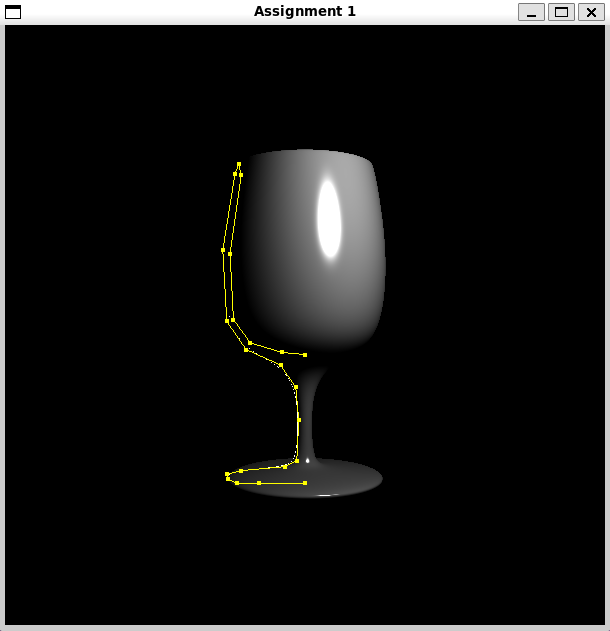

# Project 1实验报告：曲线和曲面的造型技术
21307130105 杨子旭 21307130424 范凯旋 

# 任务1：曲线的绘制
## 任务要求
你的程序必须能够生成和显示分段三次B´ezier和B样条曲线。此
外，它必须正确计算局部坐标系（包括法向量N，切向量T，和次
法线向量B）并显示它们。你应该将曲线渲染为白色，并将N、B
和T向量分别渲染为红色、绿色和蓝色。
## B`ezier曲线
### B`ezier曲线的定义
B`ezier曲线是由一组控制点V确定的参数曲线。
对于三次 B`ezier 曲线，其公式为：

```
B(t) = (1 - t)^3 * P0 + 3 * (1 - t)^2 * t * P1 + 3 * (1 - t) * t^2 * P2 + t^3 * P3
```

其中：
- `P0`, `P1`, `P2`, `P3` 为控制点；
- `t ∈ [0, 1]` 是参数；
- 曲线从 `P0` 开始，在 `P3` 结束，受中间两个控制点 `P1` 和 `P2` 影响其形状。

B\`ezier曲线的切向量是位置对参数 `t` 的导数，表示曲线上某点的方向。三次曲线的导数为：

```
B'(t) = -3(1 - t)^2 * P0 
      + 3(1 - t)^2 * P1 - 6(1 - t)t * P1 
      + 6(1 - t)t * P2 - 3t^2 * P2 
      + 3t^2 * P3
```

并归一化（normalize）以得到单位切向量。

计算一条空间曲线的Frenet坐标系需要定义：
- 切向量 T（Tangent）：如上所述；
- 法向量 N（Normal）：方向为切向量变化方向；
- 次法线 B（Binormal）：与 T 和 N 叉积而得，满足右手系。

由于直接计算 T' 的方向较为复杂，实际中通常如下方法来生成法线：

1. 选取一个初始向量 B'，例如 z 轴方向 `(0, 0, 1)`。
2. 若 `B'` 与当前切向量 `T` 共线（叉积接近 0），则尝试改用 x 轴或 y 轴。
3. 用叉积求得法线：
   ```
   N = normalize(cross(B', T))
   ```
4. 再通过：
   ```
   B = normalize(cross(T, N))
   ```
   得到正交的次法线。

这种构造方式保证了 `(T, N, B)` 三个方向彼此正交，构成Frenet坐标系。
### 代码实现思路
本次实验中，我们通过如下步骤实现 B`ezier 曲线的绘制：

1. 参数检查：确保控制点数量满足3n+1的要求（表示存在若干段B\`ezier曲线，每段需要4个点，实现过程利用三次B\`ezier曲线，因此我们以四个控制顶点为一组来绘制曲线；为了保证曲线的连续性，每次绘制以上一段曲线的终点作为下一段曲线的起点）。
```cpp
Curve evalBezier(const vector< Vector3f >& P, unsigned steps)
{
    // 检查控制点数量是否合法
    if (P.size() < 4 || P.size() % 3 != 1)
    {
        cerr << "evalBezier must be called with 3n+1 control points." << endl;
        exit(0);
    }
```
2. 曲线分段处理：每4个点为一组，绘制一段三次B`ezier曲线。
```cpp
    // 分段处理贝塞尔曲线
    for (size_t i = 0; i + 3 < P.size(); i += 3)
    {
        // 获取当前段的 4 个控制点
        Vector3f P1 = P[i];
        Vector3f P2 = P[i + 1];
        Vector3f P3 = P[i + 2];
        Vector3f P4 = P[i + 3];
        // 递推地生成当前段的曲线点
        for (unsigned j = 0; j <= steps; ++j)
        {
            // 计算参数 t
            float t = static_cast<float>(j) / steps;
```
3. 切向量计算：对每个采样点计算其位置和曲线的切线向量，带入公式。
```cpp
            // 计算贝塞尔曲线的位置
            Vector3f position = P1*(1-3*t+3*pow(t,2)-pow(t,3))+
								P2*(3*t-6*pow(t,2)+3*pow(t,3))+
								P3*(3*pow(t,2)-3*pow(t,3))+
								P4*(pow(t,3));
            // 计算贝塞尔曲线的切向量
            Vector3f tangent = P1*(-3+6*t-3*pow(t,2))+
								P2*(3-12*t+9*pow(t,2))+
								P3*(6*t-9*pow(t,2))+
								P4*(3*pow(t,2)); 
            tangent.normalize();               
```
4. 法向量(normal)与次法向量(binormal)计算：利用右手法则计算法向量与次法向量，确保曲线表面方向一致。
```cpp
            //计算次法线
			Vector3f B_prime = b;
			if (Vector3f::cross(B_prime,tangent).abs() < 1e-6f)
			{
				if(Vector3f::cross(tangent,b_x).abs() >= 1e-6f)
				{
					B_prime = b_x;
				}
				else if (Vector3f::cross(tangent,b_y).abs() >= 1e-6f)
				{
					B_prime =b_y;
				}
				else{
					cerr<<("Error::Can't find a B_0!")<<endl;
					exit(0);
				}
			}
			Vector3f normal = Vector3f::cross(B_prime,tangent).normalized();
			Vector3f binormal = Vector3f::cross(tangent,normal).normalized();
```
5. 存储曲线点：将每个点的属性（位置、切线、法线、次法线）保存到Curve中返回。
```cpp
            // 创建曲线点并添加到曲线中
            CurvePoint point;
            point.V = position;
            point.T = tangent;
            point.N = normal;
            point.B = binormal;
            curve.push_back(point);
```

## B样条曲线
### B样条曲线的定义
B样条曲线是一种分段定义的平滑曲线，具有良好的连续性和局部可控性。与 B`ezier 曲线相比，B样条支持任意数量的控制点，并能生成更平滑、可控的曲线段。

对于三次均匀B样条曲线，其每一段是由4个连续控制点定义的，曲线在各段之间具有二阶导数连续性（$C^2$ 连续）。三次B样条的每一段都可以通过变换为B`ezier曲线段来进行评估。

三次均匀B样条曲线的每一段可转换为一个B\`ezier曲线段。给定连续的4个B样条控制点$P_0, P_1, P_2, P_3$，可通过如下变换得到对应的 B\`ezier 控制点：

```
B0 = (P0 + 4*P1 + P2) / 6
B1 = (2*P1 + P2) / 3
B2 = (P1 + 2*P2) / 3
B3 = (P1 + 4*P2 + P3) / 6
```

这样我们就可以利用已实现的 `evalBezier`函数来进行曲线段的评估，从而拼接出完整的B样条曲线。

### 代码实现思路
1. 将曲线分段控制，每组包含4个点，转换为B`ezier控制点。
```cpp
    // 将B样条曲线转换为分段贝塞尔曲线
    for (size_t i = 0; i + 3 < P.size(); ++i)
    {
        // 获取当前段的4个控制点
        Vector3f P0 = P[i];
        Vector3f P1 = P[i + 1];
        Vector3f P2 = P[i + 2];
        Vector3f P3 = P[i + 3];

        // 将B样条控制点转换为贝塞尔控制点
        Vector3f B0 = (P0 + 4 * P1 + P2) / 6.0f;
        Vector3f B1 = (2 * P1 + P2) / 3.0f;
        Vector3f B2 = (P1 + 2 * P2) / 3.0f;
        Vector3f B3 = (P1 + 4 * P2 + P3) / 6.0f;

        // 构建贝塞尔控制点向量
        vector< Vector3f > bezierPoints = { B0, B1, B2, B3 };
```
2. 调用前面实现的`evalBezier`函数生成曲线段，添加到结果中。
```cpp
        // 调用 evalBezier 生成贝塞尔曲线段
        Curve bezierSegment = evalBezier(bezierPoints, steps);

        // 将生成的贝塞尔曲线段添加到结果曲线中
        curve.insert(curve.end(), bezierSegment.begin(), bezierSegment.end());
```
# 任务2：曲面的绘制
## 旋转曲面
### 旋转曲面实现方式
根据齐次坐标的旋转和平移变换的公式，给定三维坐标 $P(x, y, z)$，要求绕 $y$ 轴旋转 $\theta$的坐标，则旋转后的坐标 $P'$（即我们要求的 `Surface.VV`）计算公式为：

$$
P' = M \cdot P
$$

其中旋转矩阵为：

$$
M = R_y(\theta) = 
\begin{bmatrix}
\cos\theta & 0 & \sin\theta & 0 \\
0 & 1 & 0 & 0 \\
-\sin\theta & 0 & \cos\theta & 0 \\
0 & 0 & 0 & 1
\end{bmatrix}
$$

根据教材，法向量计算有：
$$
N' = normalize((M^{-1})^T \cdot N)
$$
由于我们假设法线将总是指向遍历方向的左边，我们需要反转曲线法线的方向得到曲面的法线（法线反向），使得曲面法向量向外。

### 代码实现思路
1. 顶点和法向量旋转生成：将 $[0, 2\pi]$ 均分为steps份，每次旋转角度为 $\frac{2\pi}{steps}$。
旋转矩阵R为绕$y$轴的旋转矩阵，用于将二维曲线绕 $y$ 轴旋转。
旋转矩阵的子矩阵（左上 3×3）用于变换法向量（旋转矩阵的逆转置即为其本身）。
```cpp
for (unsigned i = 0; i < steps; ++i)
{
    float theta = (2 * M_PI * i) / steps;

    Matrix4f R = Matrix4f(cos(theta),  0, sin(theta), 0,
                          0,           1, 0,          0,
                         -sin(theta),  0, cos(theta), 0,
                          0,           0, 0,          1);

    Matrix3f invTransR = R.getSubmatrix3x3(0,0);
```
2. 生成三角面片：每两个相邻旋转步之间的曲线点组成一个四边形，该四边形被划分为两个三角形，使用 % steps 保证最后一个面片与第一个连接，形成闭环结构。
```cpp
for (unsigned i = 0; i < steps; ++i) {
    unsigned next_i = (i + 1) % steps;
    for (size_t j = 0; j + 1 < profile.size(); ++j) {
        unsigned current = i * profile.size() + j;
        unsigned next = next_i * profile.size() + j;
        unsigned current_next = i * profile.size() + j + 1;
        unsigned next_next = next_i * profile.size() + j + 1;

        surface.VF.push_back(Tup3u(current, current_next, next));
        surface.VF.push_back(Tup3u(next, current_next, next_next));
    }
}
```


## 广义圆柱体
### 广义圆柱体
将一个二维轮廓曲线 \( P(u) \) 在三维空间中，沿着一条扫掠路径 \( C(v) \) 进行移动，并且在每个位置根据该点的 Frenet 框架（Tangent, Normal, Binormal）进行刚体变换。

数学表达式：

\[
S(u,v) = C(v) + P_x(u) \cdot B(v) + P_y(u) \cdot N(v) + P_z(u) \cdot T(v)
\]

- \( C(v) \)：扫掠曲线上的点
- \( P(u) \)：轮廓曲线上的点（必须是二维的，一般在 xy 平面）
- \( T(v), N(v), B(v) \)：扫掠曲线上的 Frenet 框架（三个正交单位向量）
- \( S(u, v) \)：最终生成的曲面上的点

用由传入参数sweep的N、B、T、V定义的坐标系，profile绕sweep旋转得到多个重复的profile，再用三角形连接这些profile的副本，即得到了广义圆柱体。

### 具体代码分析
1. 提取扫掠曲线上的点和Frenet框架信息：遍历扫掠曲线上的每一个采样点`sweep[i]`，并提取该点的三维位置V和对应的 Frenet框架。
```cpp
// 遍历扫掠曲线的点
    for (size_t i = 0; i < sweep.size(); ++i)
    {
        // 获取当前扫掠曲线的 Frenet 框架（T, N, B）
        Vector3f sweepPoint = sweep[i].V;
        Vector3f sweepTangent = sweep[i].T;
        Vector3f sweepNormal = sweep[i].N;
        Vector3f sweepBinormal = sweep[i].B;
```
2. 轮廓点在Frenet框架中变换：profilePoint原本处于二维空间，其三个分量在局部坐标系中分别代表沿 binormal、normal、tangent 方向的位移；法向量也要通过同样方式进行旋转变换，生成正确朝向的法线。
```cpp
       // 遍历轮廓曲线的点
        for (size_t j = 0; j < profile.size(); ++j)
        {
            // 变换顶点位置
            Vector3f profilePoint = profile[j].V;
            Vector3f transformedPoint = sweepPoint +
                                        profilePoint.x() * sweepBinormal +
                                        profilePoint.y() * sweepNormal +
                                        profilePoint.z() * sweepTangent;
            surface.VV.push_back(transformedPoint);

            // 变换法向量（使用 Frenet 框架）
            Vector3f profileNormal = profile[j].N;
            Vector3f transformedNormal = profileNormal.x() * sweepBinormal +
                                        profileNormal.y() * sweepNormal +
                                        profileNormal.z() * sweepTangent;
            transformedNormal.normalize();  // 确保单位长度
            transformedNormal.negate();
            surface.VN.push_back(transformedNormal);
        }
    }
```
3. 构造三角面片
```cpp
    // 生成三角面片（与原代码一致）
    for (size_t i = 0; i + 1 < sweep.size(); ++i)
    {
        for (size_t j = 0; j + 1 < profile.size(); ++j)
        {
            unsigned current = i * profile.size() + j;
            unsigned next = (i + 1) * profile.size() + j;
            unsigned current_next = i * profile.size() + j + 1;
            unsigned next_next = (i + 1) * profile.size() + j + 1;

            surface.VF.push_back(Tup3u(current, next, current_next));
            surface.VF.push_back(Tup3u(next, next_next, current_next));
        }
    }
```
# 结果展示






















